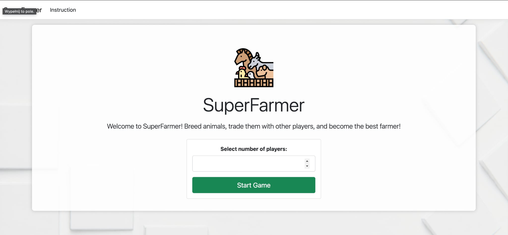

## Jak uruchomić aplikację?

1. Upewnij się, że masz zainstalowany **.NET SDK (8.0 lub nowszy)**.
2. Otwórz folder projektu.
3. Przejdź do folderu z projektem `SuperFarmer`.
4. Uruchom aplikację:
    ```bash
    dotnet run
    ```
5. Otwórz przeglądarkę i przejdź do adresu `http://localhost:5240`

---

## Architektura i podejście

Projekt został zrealizowany jako **monolityczna aplikacja webowa** w **ASP.NET Core MVC**.  
Nie korzysta z bazy danych – dane są przechowywane w pamięci aplikacji (singleton `Game`).

Zdecydowałem się na takie rozwiązanie, ponieważ miałem bardzo mało czasu, a gra farmer to głównie operacje na danych i ich prezentacja. Dzięki temu webowa wersja była najprostsza do wdrożenia i wystarczająca funkcjonalnie.

Z perspektywy czasu widzę jednak, że webówka nie była idealnym wyborem – pojawiło się wiele sytuacji, które byłyby łatwiejsze do rozwiązania w innej architekturze (np. wymiany między graczami, usuwanie gracza po wygranej, synchronizacja stanu, lepsze zarządzanie UI).

Gdybym miał więcej czasu:
- oddzieliłbym frontend od backendu (np. **API + Frontend** albo **Blazor WebAssembly**),
- umożliwiłbym grę między użytkownikami online,
- dodałbym zapisywanie i wczytywanie stanu gry (np. z użyciem bazy danych),
- rozważyłbym stworzenie **aplikacji w .NET MAUI**.

Obecne podejście to **kompromis** między szybkością realizacji a funkcjonalnością.  
Projekt działa i pozwala rozegrać pełną partię SuperFarmera z obsługą wszystkich głównych zasad gry.


### 📸 Zrzuty ekranu z gry

Poniżej kilka przykładowych widoków z aplikacji:



  


