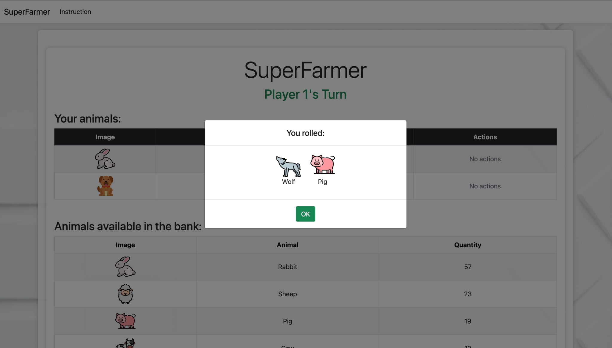

## Jak uruchomić aplikację?

1. Upewnij się, że masz zainstalowany **.NET SDK (8.0 lub nowszy)**.
2. Otwórz folder projektu.
3. Przejdź do folderu z projektem `SuperFarmer`.
4. Uruchom aplikację:
    ```bash
    dotnet run
    ```
5. Otwórz przeglądarkę i przejdź do adresu `http://localhost:5240`

---

## Architektura i podejście

Ze względu na ograniczone ramy czasowe zdecydowałem się na możliwie najprostsze rozwiązanie — czyli monolityczną aplikację webową w ASP.NET Core MVC bez bazy danych.
Mimo jednak krótkiego czasu, starałem się zrobić produkt MVP, który bedzie zawierał podstawową logikę gry.

Uważam, że przy większym zakresie czasowym projekt mógłby zostać rozszerzony o

1. Integrację z bazą danych (np. PostgreSQL lub SQLite), aby umożliwić trwałe zapisywanie rozgrywek. 
2. Gruntowny refaktoring kodu, aby poprawić jego jakość i czytelność (unikanie powtórzeń, więcej klas etc)
3. Wprowadzenie wzorców projektowych (Repository, Service)
4. Dodanie logowania i autoryzacji użytkowników -- pozwoliłby to na grę online
5. Dodanie testów jednostkowych i integracyjnych

Nie jest to  aplikacja 'perfekcyjna' lecz jednak jest to prototyp napisany w dwa wieczory ;) 

### Zrzuty ekranu z gry

Poniżej kilka przykładowych widoków z aplikacji:


  



